# GuitarChordsClassification 🎸

[Link Dataset _GuitarChordsClassification_](https://drive.google.com/drive/folders/1h4kLXmCjUdlykKrkz9aZzFV_LxjnrMZ8)

### Halo Semua!, Hello everyone!, Hola Amigo!, みなさんこんにちは!, 안녕하세요 여러분!,  👋👋 
### Kami dari Kelompok 3 Kelas B1 2020 adalah Praktikan yang membuat Tugas Proyek Akhir Praktikum Kecerdasan Buatan 🤖🤖 Kelompok Kami yang berangottakan,

#### - Raymond Jonathan Damanik / _2009106057_ 
[](https://github.com/Raymond211101)
- Sebagai Ketua Kelompok
- Sebagai yang membuat dan mengatur bagian _Pre-Processing_ ⌛

#### - Muhammad Wendra Suryananda / _2009106056_ 
[](https://github.com/wendra08)
- Sebagai yang membuat dan mengatur bagian _Modelling_ 🔍

#### - Muhammad Nizar / _2009106059_ 
[](https://github.com/Sukoshi2)
- Sebagai yang membuat dan mengatur bagian _Data Visualization and Data Analyst_ 📊

## Deskripsi

### Klasifikasi Pola Kunci Dasar Gitar - _GuitarChordsClassification_ 🎸🎸
Kelompok Kami Mencoba Klasifikasi Gambar atau Citra untuk mengenali pola kunci dasar gitar menggunakan Image Processing dan menggunakan Metode _Convolutional Neural Network_ (CNN) pada Deep Learning.

karena banyak orang yang tidak bisa memainkan atau mengenali pola kunci dasar alat musik gitar(termasuk penulis readme.md ini :v)  karena itu kami akan mencoba membuat sebuah projek atau program yang membuat sebuah Kecerdasan Buatan / _Artificial Intellegence_ akan melakukan klasifikasi, mengenali pola Kunci Dasar Gitar yang berupa Gambar atau Citra.

### Penjelasan DataSet
Dari Penjelasan Diatas, Sebuah sistem akan mengenali 7 jenis atau label kunci dasar gitar yaitu :
1. **`A`**
2. **`B`**
3. **`C`**
4. **`D`**
5. **`E`**
6. **`F`**
7. **`G`**

dataset disimpan di google drive @Wendra linknya [disini](https://drive.google.com/drive/folders/1h4kLXmCjUdlykKrkz9aZzFV_LxjnrMZ8)
yang dibagi menjadi berberapa Direktori atau Folder dari Kunci A sampai G dimana sistem akan mengenali atau klasifikasi mana gambar yang merupakan kunci dasar gitar `A`, `B`, `C`, `D`, `E`, `F`, `G` 

dengan Code untuk visualisasi semua data
- loop untuk menyimpan jumlah masing-masing file tiap kelas kedalam list
- mengambil jumlah file gambar dari tiap kelas
- mengambil banyaknya jumlah file menggunakan panjang dari jumlah file per kelas
- mengisi list kosong dari panjang banyaknya file

```python
list_jumlah_file_all = []

for kelas in os.listdir(base_dir):
    list_file_kelas = os.listdir(os.path.join(base_dir, kelas)) 
    banyaknya_file = len(list_file_kelas)
    list_jumlah_file_all.append(banyaknya_file) 
    
x = class_name
y = list_jumlah_file_all 
f = plt.figure()
f.set_figwidth(11)
f.set_figheight(5)
plt.bar(x, y, color=palette1)
plt.title('Jumlah Gambar Keseluruhan', loc='right')
plt.xlabel('Kunci Dasar Gitar')
plt.ylabel('Jumlah Data', loc='bottom')
plt.show()
```

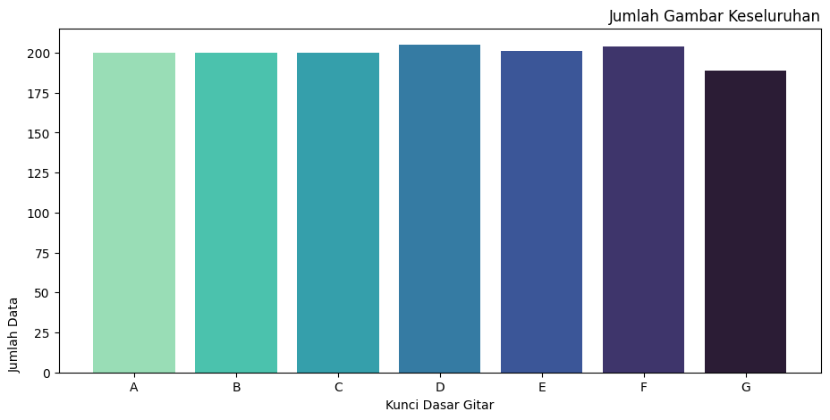
- Jumlah Dataset A sebanyak 200 Data Gambar
- Jumlah Dataset B sebanyak 200 Data Gambar
- Jumlah Dataset C sebanyak 200 Data Gambar
- Jumlah Dataset D sebanyak 205 Data Gambar
- Jumlah Dataset E sebanyak 200 Data Gambar
- Jumlah Dataset F sebanyak 203 Data Gambar
- Jumlah Dataset G sebanyak 203 Data Gambar


sebelum itu, harus membagi direktori Training, Validation, dan Testing
dengan code untuk membagi direktori file
- menggunakan libary split folder
  - dimana akan langsung membagi menjadi 3 direktori yaitu
    - Training
    - Validation
    - Testing
  - dengan rasio perbandingan
    - Training 70%
    - Validaton 10%
    - Testing 20%
```python
splitfolders.ratio(
    base_dir,
    output='ready_dataset',
    ratio=(.7, 0.1,0.2)
)
```
untuk code pada visualisasi dataset Training, Validation, Testing sama seperti visualisasi semua data tapi dibedakan nama direktorinya

Data Train
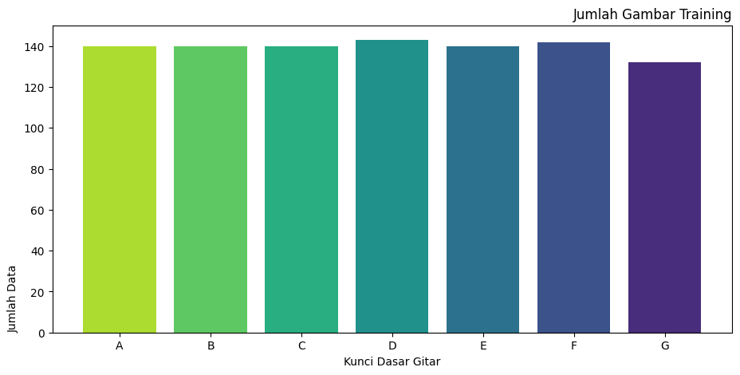
- Jumlah Dataset A sebanyak 140 Data Gambar
- Jumlah Dataset B sebanyak 140 Data Gambar
- Jumlah Dataset C sebanyak 140 Data Gambar
- Jumlah Dataset D sebanyak 142 Data Gambar
- Jumlah Dataset E sebanyak 140 Data Gambar
- Jumlah Dataset F sebanyak 141 Data Gambar
- Jumlah Dataset G sebanyak 141 Data Gambar

Data Validation
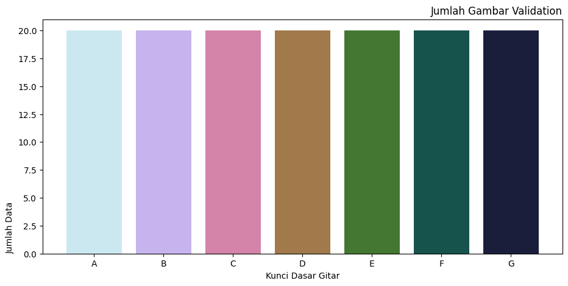
- Jumlah Dataset A sebanyak 20 Data Gambar
- Jumlah Dataset B sebanyak 20 Data Gambar
- Jumlah Dataset C sebanyak 20 Data Gambar
- Jumlah Dataset D sebanyak 20 Data Gambar
- Jumlah Dataset E sebanyak 20 Data Gambar
- Jumlah Dataset F sebanyak 20 Data Gambar
- Jumlah Dataset G sebanyak 20 Data Gambar

Data Testing
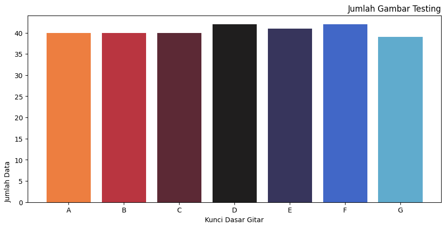
- Jumlah Dataset A sebanyak 40 Data Gambar
- Jumlah Dataset B sebanyak 40 Data Gambar
- Jumlah Dataset C sebanyak 40 Data Gambar
- Jumlah Dataset D sebanyak 42 Data Gambar
- Jumlah Dataset E sebanyak 41 Data Gambar
- Jumlah Dataset F sebanyak 42 Data Gambar
- Jumlah Dataset G sebanyak 42 Data Gambar

### Penjelasan _Pre-Processing_
Pertama kita Augmentasi data Training, Validation dan Testing. augmentasi adalah proses cara untuk menambahkan data sintetik.

kita membuat data generatornya terlebih dahulu sebelum di proses ke tiap direktori dengan code
Pada data Training, Validation dan Testing terdapat perbedaan pada Augmentasi dimana.

Pada Data Train Terdapat beberapa Augmentasi Gambar :
- Penskalaan menggunakan ReScale sebanyak 1/255
- Memutar gambar dengan kemiringan 20
- Pencahayaan rentang dari 0.5 sampai 1 misalkan nilai kurang dari 1 lebih gelap
- Mengatur pengskalaan gambar sebesar 0.2
- Mengatur gambar menjadi lebih dekat rentang 0.8 sampai 1 misalkan nilai kurang dari 1 akan zoom in
- Fambar akan diputar secara horizontal (lurus)
- Gambar akan diputar secara vertikal (keaatas)

Pada Data Validation dan Testing hanya 1 augmentasi gambar yaitu :
- Penskalaan menggunakan ReScale sebanyak 1/255
```python
train_datagen = ImageDataGenerator(
                    rescale=1./255,
                    rotation_range=20, 
                    brightness_range=(0.5,1.0), 
                    shear_range=0.2, 
                    zoom_range=(0.8,1.0), 
                    fill_mode='nearest', 
                    horizontal_flip=True,
                    vertical_flip=True)

val_datagen = ImageDataGenerator(rescale=1./255)
test_datagen = ImageDataGenerator(rescale=1./255)
```
Setelah itu data akan dimasukkan ke dalam generator untuk di Proses Augmentasi dalam generator ada perubahan untuk gambar :

- Nama masing-masing direktori ada train_dir, val_dir, test_dir
- Resolusi gambar dirubah menjadi 150x150
- Untuk menentukan jumlah gambar yang digunakan untuk menentukan step per training
- untuk kelasnya kategorikal 

```python
train_generator = train_datagen.flow_from_directory(
    train_dir,
    target_size=(150,150),
    batch_size=32,
    class_mode='categorical'
)

val_generator = val_datagen.flow_from_directory(
    val_dir,
    target_size=(150,150),
    batch_size=32,
    class_mode='categorical'
)

test_generator = test_datagen.flow_from_directory(
    test_dir,
    target_size=(150,150),
    batch_size=32,
    class_mode='categorical'
)
```
setelah itu dapat memperlihatkan gambar yang sudah di augmentasi dengan visualisasi gambar pada tiap label direktorinya
```python
plt.figure(figsize=(7,7))
for i in range(9):
  ax = plt.subplot(3, 3, i + 1)
  plt.imshow(image[i])
  plt.title(class_name[np.argmax(label[i])])
  plt.axis("off")
```
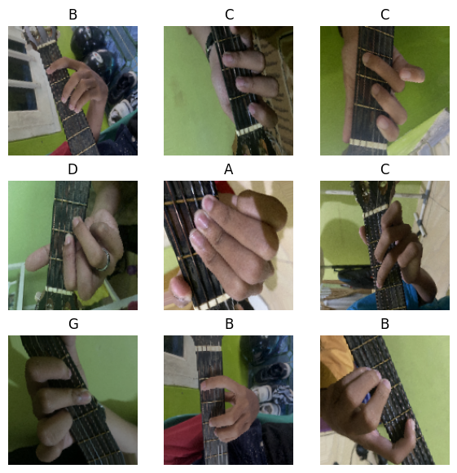

Visualisasi gambar dengan Shape
```python
for _ in range(7):
  img, label = train_generator.next() 
  print("Ukuran gambar :",img.shape)
  plt.imshow(img[i])
  plt.show()
```
```python
Ukuran gambar : (32, 150, 150, 3)
```
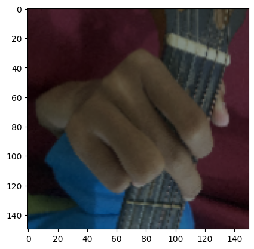

### Penjelasan _Modelling_

Membuat model dengan layer-layer yang dibuat dibagi menjadi 3 Input Layer, Hidden Layer, Output Layer menggunakan model tipe sequential
- Pertama Input layer
    - Convolution filter sebanyak 32, input shape sesuai dengan gambar
    - fungsi aktivasi ReLU membuat Neural Network menjadi non-linear untuk menghitung total dari Weight
       - fungsi aktivasi ReLU dapat dilihat dari gabar berikut
       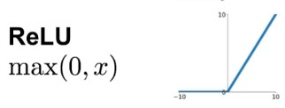


- Kedua Hidden Layer
    - Pooling sebanyak 4 dengan matrix 2x2 
    - Convolution filter yang berbeda dari 64 sampai 128 dengan matrix 3x3 dengan Aktivasi ReLu
    - Layer Dropout 0.2 agar tidak terjadinya overfitting di atur nilai neuron nya
    - Layer Flatten untuk reshaping menyatukan inputan yang memiliki banyak dimensi
    - Layer Dense sebanyak 128 filter untuk saling menghubungkan antar layer
- Ketiga Output layer
    - Layer dense sebanyak 7 filter dan fungsi aktivasi softmax
```python
model = tf.keras.models.Sequential([
    tf.keras.layers.Conv2D(32, (3,3), activation='relu', input_shape=(150,150,3)), #input layer
    # Hidden Layer
    tf.keras.layers.MaxPooling2D(2,2),
    tf.keras.layers.Conv2D(64, (3,3), activation='relu'),
    tf.keras.layers.MaxPooling2D(2,2),
    tf.keras.layers.Conv2D(128, (3,3), activation='relu'),
    tf.keras.layers.MaxPooling2D(2,2),
    tf.keras.layers.Conv2D(128, (3,3), activation='relu'),
    tf.keras.layers.MaxPooling2D(2,2),
    tf.keras.layers.Dropout(0.2),
    tf.keras.layers.Flatten(),
    tf.keras.layers.Dense(128, activation='relu'),
    # Hidden Layer
    tf.keras.layers.Dense(7, activation='softmax') # output Layer
])
```
Membuat fungsi callback :

Akurasi pada Iterasi(epoch) diatas 20 tidak bertambah proses fitting akan seketika berhenti

```python
from keras.callbacks import EarlyStopping

monitor_val_acc = EarlyStopping(monitor='accuracy',
                  patience=6)
```

compile model untuk mengatur konfigurasi model
- optimizer menggunakan metode Adam
- loss menggunakan metode Categorical Crossentropy
- kriteria berdasarkan 
    - akurasi dimana akurasi pasti ada loss
    - recall
    - precision

```python
model.compile(optimizer='adam',
              loss='categorical_crossentropy', 
              metrics=['accuracy', tf.keras.metrics.Recall(), tf.keras.metrics.Precision()])
```
Melatih data dengan menambahkan data yang sudah di augmentasi dengan iterasi(epoch) sebanyak 30, dan validation data sesuai dengan data validation yang sudah di augmentasi, dan fungsi callback untuk memanggil fungsi perubahan EarlyStopping
```python
history = model.fit(
    train_generator,
    epochs=30,
    validation_data=val_generator,
    callbacks=[monitor_val_acc]
)
```

#### Visualiasi Accuracy, Loss, Recall, Precision

memanggil fungsi panjang dari history dari akurasi/loss/recall/precision atau epochnya untuk dijadikan sumbu x


memanggil fungsi history dari akurasi/loss/recall/precision untuk dijadikan sumbu y

```python
plt.figure(1, figsize=(10,10))
plt.plot(range(len(history.history['accuracy'])), #'loss' /'recall' / 'precision'
         history.history['accuracy'], 
         'co-',
         label='training')
plt.plot(range(len(history.history['val_accuracy'])), 
         history.history['val_accuracy'],
         'bD--',
         label='validation')
plt.title('Training & Validation Accuracy')
plt.legend()
plt.xlabel("Epochs")
plt.ylabel("Accuracy")
plt.show()
```

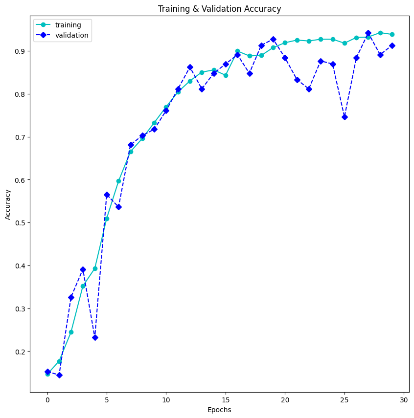

penjelasan gambar diatas

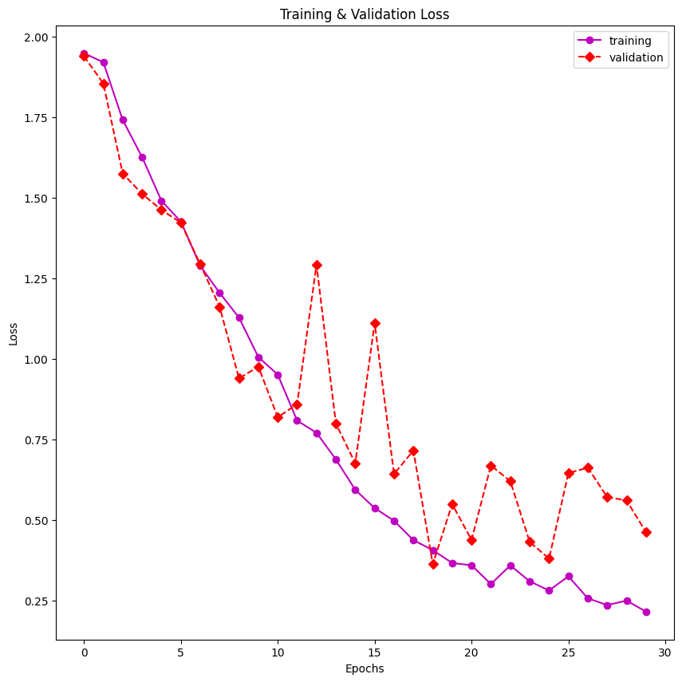

penjelasan gambar diatas

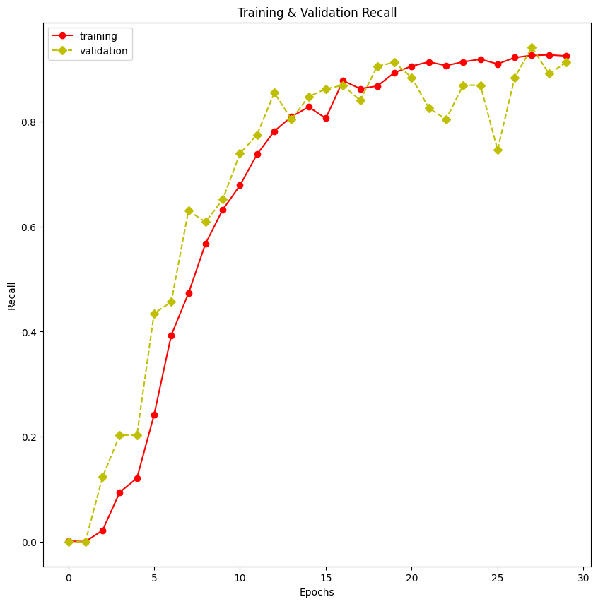

penjelasan gambar diatas

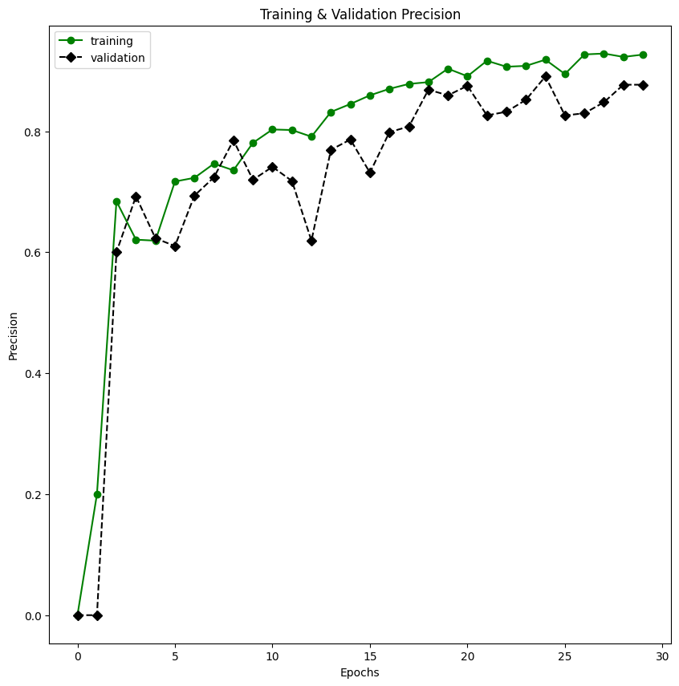

penjelasan gambar diatas

