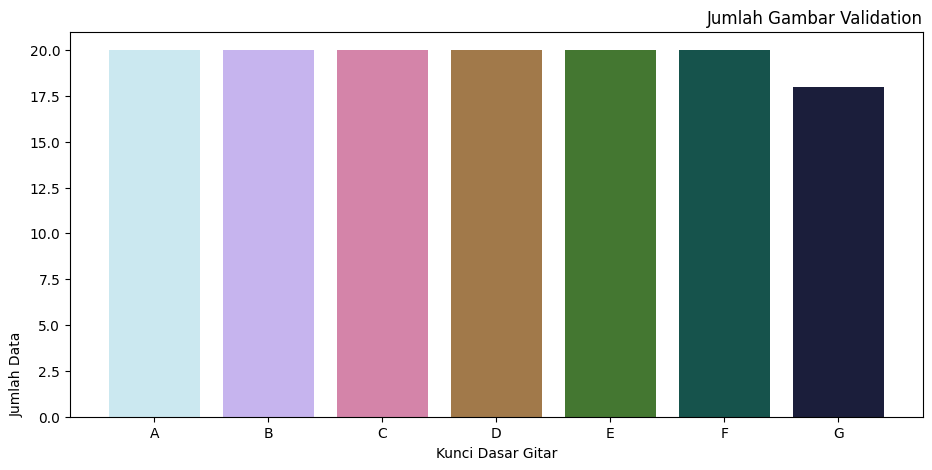

# GuitarChordsClassification 🎸

[Link Dataset _GuitarChordsClassification_](https://drive.google.com/drive/folders/1h4kLXmCjUdlykKrkz9aZzFV_LxjnrMZ8)

### Halo Semua!, Hello everyone!, Hola Amigo!, みなさんこんにちは!, 안녕하세요 여러분!,  👋👋 
### Kami dari Kelompok 3 Kelas B1 2020 adalah Praktikan yang membuat Tugas Proyek Akhir Praktikum Kecerdasan Buatan 🤖🤖 Kelompok Kami yang berangottakan,

#### - Raymond Jonathan Damanik / _2009106057_ 
[](https://github.com/Raymond211101)
- Sebagai Ketua Kelompok
- Sebagai yang membuat dan mengatur bagian _Pre-Processing_ ⌛

#### - Muhammad Wendra Suryananda / _2009106056_ 
[](https://github.com/wendra08)
- Sebagai yang membuat dan mengatur bagian _Modelling_ 🔍

#### - Muhammad Nizar / _2009106059_ 
[](https://github.com/Sukoshi2)
- Sebagai yang membuat dan mengatur bagian _Data Visualization and Data Analyst_ 📊

## Deskripsi

### Klasifikasi Pola Kunci Dasar Gitar - _GuitarChordsClassification_ 🎸🎸
Kelompok Kami Mencoba Klasifikasi Gambar atau Citra untuk mengenali pola kunci dasar gitar menggunakan Image Processing dan menggunakan Metode _Convolutional Neural Network_ (CNN) pada Deep Learning.

karena banyak orang yang tidak bisa memainkan atau mengenali pola kunci dasar alat musik gitar(termasuk penulis readme.md ini :v)  karena itu kami akan mencoba membuat sebuah projek atau program yang membuat sebuah Kecerdasan Buatan / _Artificial Intellegence_ akan melakukan klasifikasi, mengenali pola Kunci Dasar Gitar yang berupa Gambar atau Citra.

### Penjelasan DataSet
Dari Penjelasan Diatas, Sebuah sistem akan mengenali 7 jenis atau label kunci dasar gitar yaitu :
1. **`A`**
2. **`B`**
3. **`C`**
4. **`D`**
5. **`E`**
6. **`F`**
7. **`G`**

dataset disimpan di google drive @Wendra linknya [disini](https://drive.google.com/drive/folders/1h4kLXmCjUdlykKrkz9aZzFV_LxjnrMZ8)
yang dibagi menjadi berberapa Direktori atau Folder dari Kunci A sampai G dimana sistem akan mengenali atau klasifikasi mana gambar yang merupakan kunci dasar gitar `A`, `B`, `C`, `D`, `E`, `F`, `G` 

dengan Code untuk visualisasi semua data
- loop untuk menyimpan jumlah masing-masing file tiap kelas kedalam list
- mengambil jumlah file gambar dari tiap kelas
- mengambil banyaknya jumlah file menggunakan panjang dari jumlah file per kelas
- mengisi list kosong dari panjang banyaknya file

```python
list_jumlah_file_all = []

for kelas in os.listdir(base_dir):
    list_file_kelas = os.listdir(os.path.join(base_dir, kelas)) 
    banyaknya_file = len(list_file_kelas)
    list_jumlah_file_all.append(banyaknya_file) 
    
x = class_name
y = list_jumlah_file_all 
f = plt.figure()
f.set_figwidth(11)
f.set_figheight(5)
plt.bar(x, y, color=palette1)
plt.title('Jumlah Gambar Keseluruhan', loc='right')
plt.xlabel('Kunci Dasar Gitar')
plt.ylabel('Jumlah Data', loc='bottom')
plt.show()
```


- Jumlah Dataset A sebanyak 200 Data Gambar
- Jumlah Dataset B sebanyak 200 Data Gambar
- Jumlah Dataset C sebanyak 200 Data Gambar
- Jumlah Dataset D sebanyak 205 Data Gambar
- Jumlah Dataset E sebanyak 200 Data Gambar
- Jumlah Dataset F sebanyak 203 Data Gambar
- Jumlah Dataset G sebanyak 203 Data Gambar


sebelum itu, harus membagi direktori Training, Validation, dan Testing
dengan code untuk membagi direktori file
- menggunakan libary split folder
  - dimana akan langsung membagi menjadi 3 direktori yaitu
    - Training
    - Validation
    - Testing
  - dengan rasio perbandingan
    - Training 70%
    - Validaton 10%
    - Testing 20%
```python
splitfolders.ratio(
    base_dir,
    output='ready_dataset',
    ratio=(.7, 0.1,0.2)
)
```
untuk code pada visualisasi dataset Training, Validation, Testing sama seperti visualisasi semua data tapi dibedakan nama direktorinya

Data Train

- Jumlah Dataset A sebanyak 140 Data Gambar
- Jumlah Dataset B sebanyak 140 Data Gambar
- Jumlah Dataset C sebanyak 140 Data Gambar
- Jumlah Dataset D sebanyak 142 Data Gambar
- Jumlah Dataset E sebanyak 140 Data Gambar
- Jumlah Dataset F sebanyak 141 Data Gambar
- Jumlah Dataset G sebanyak 141 Data Gambar

Data Validation

- Jumlah Dataset A sebanyak 20 Data Gambar
- Jumlah Dataset B sebanyak 20 Data Gambar
- Jumlah Dataset C sebanyak 20 Data Gambar
- Jumlah Dataset D sebanyak 20 Data Gambar
- Jumlah Dataset E sebanyak 20 Data Gambar
- Jumlah Dataset F sebanyak 20 Data Gambar
- Jumlah Dataset G sebanyak 20 Data Gambar

Data Testing

- Jumlah Dataset A sebanyak 40 Data Gambar
- Jumlah Dataset B sebanyak 40 Data Gambar
- Jumlah Dataset C sebanyak 40 Data Gambar
- Jumlah Dataset D sebanyak 42 Data Gambar
- Jumlah Dataset E sebanyak 41 Data Gambar
- Jumlah Dataset F sebanyak 42 Data Gambar
- Jumlah Dataset G sebanyak 42 Data Gambar

### Penjelasan _Pre-Processing_
(PENJELASAN DARI Pre-Processing SEMUA TARO DISINI)

### Penjelasan _Modelling_
(PENJELASAN dari Modelling SEMUA TARO DISINI)

```python
```