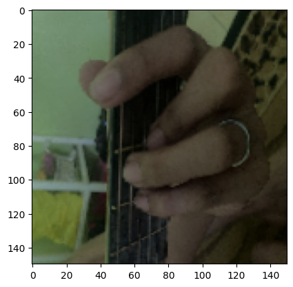
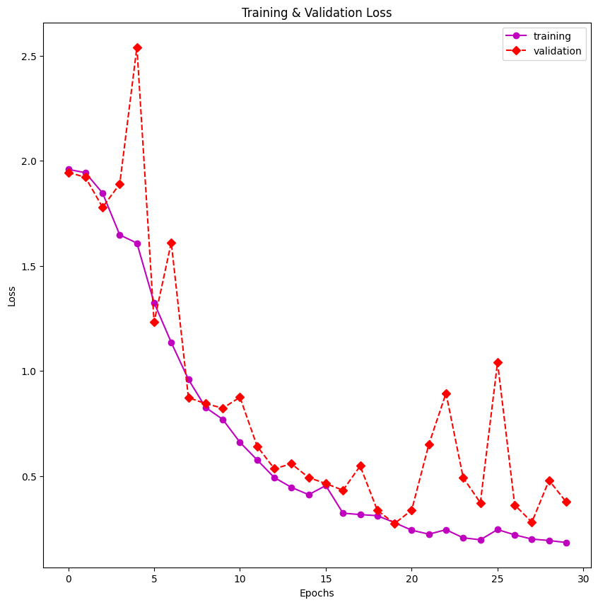
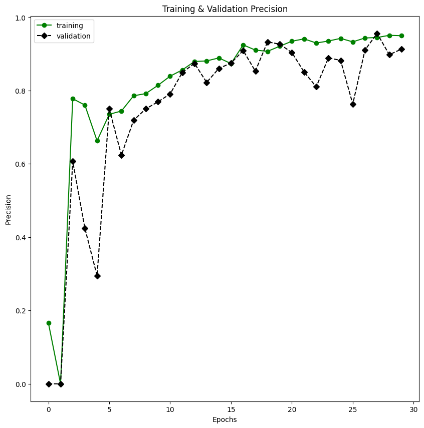
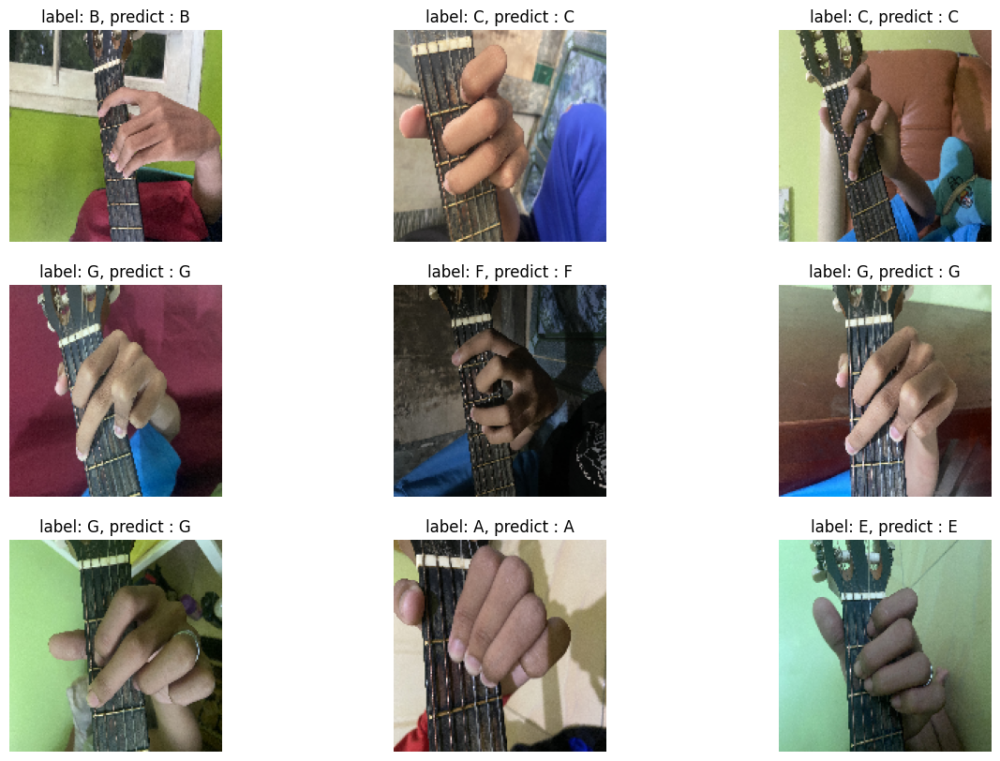
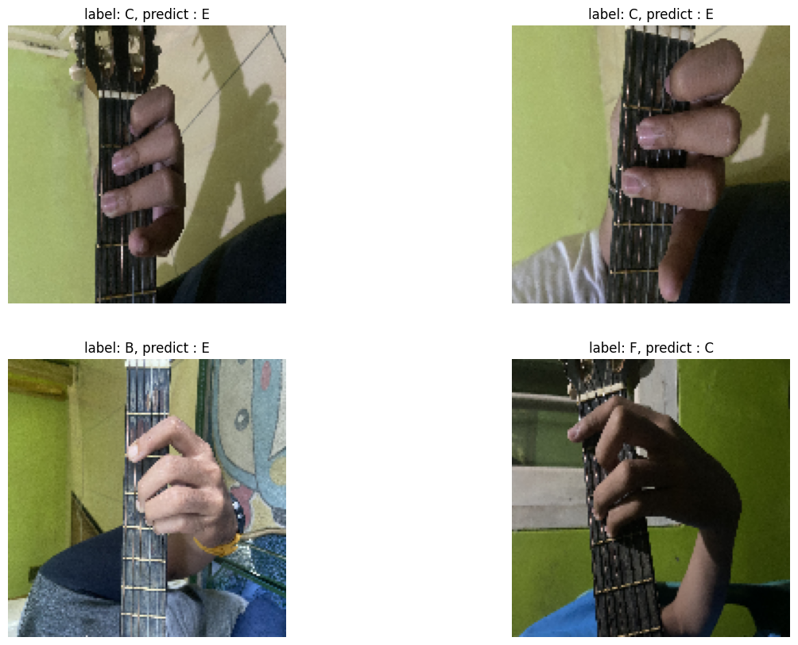
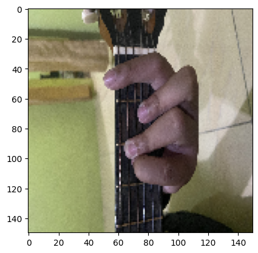

<div align="center">
    <h1>PROYEK AKHIR<br><b>Guitar Chords Classification🎸</b></h1><br>
    <div>
        <a>
            
        </a>
        <p><h2>Presented for :</h2></p>
        <a>
            
        </a>
        <a>
            
        </a><br><br>
        <div align="center">
            <p style="font-size: 18px;">
                Program Studi Informatika<br>
                Fakultas Teknik<br>
                Universitas Mulawarman
            </p>
        </div>
    </div>
</div>

<div align="center">
    <div>
        <p><h2>Halo Semua!, Hello everyone!, Hola Amigo!, みなさんこんにちは!, 안녕하세요 여러분!,  👋👋<h2>
        <p><h4>Kami dari Kelompok 3 Kelas B1 2020 adalah Praktikan yang membuat Tugas Proyek Akhir Praktikum Kecerdasan Buatan 🤖 Kelompok Kami yang berangottakan,</h4></p>
        <div>
            <p><h3>
                Raymond Jonathan Damanik 2009106057 (Ketua)<br>
                Muhammad Wendra Suryananda 2009106056<br>
                Muhammad Nizar 2009106059
            </h3></p>
        </div>
    </div>
</div>


#### - Raymond Jonathan Damanik / _2009106057_ 
[](https://github.com/Raymond211101)
- Sebagai Ketua Kelompok
- Sebagai yang membuat dan mengatur bagian _Pre-Processing_ ⌛

#### - Muhammad Wendra Suryananda / _2009106056_ 
[](https://github.com/wendra08)
- Sebagai yang membuat dan mengatur bagian _Modelling_ 🔍

#### - Muhammad Nizar / _2009106059_ 
[](https://github.com/Sukoshi2)
- Sebagai yang membuat dan mengatur bagian _Data Visualization and Data Analyst_ 📊

## Deskripsi

### Klasifikasi Pola Kunci Dasar Gitar - _GuitarChordsClassification_ 🎸🎸
Kelompok Kami Mencoba Klasifikasi Gambar atau Citra untuk mengenali pola kunci dasar gitar menggunakan Image Processing dan menggunakan Metode _Convolutional Neural Network_ (CNN) pada Deep Learning.

karena banyak orang yang tidak bisa memainkan atau mengenali pola kunci dasar alat musik gitar(termasuk penulis readme.md ini :v)  karena itu kami akan mencoba membuat sebuah projek atau program yang membuat sebuah Kecerdasan Buatan / _Artificial Intellegence_ akan melakukan klasifikasi, mengenali pola Kunci Dasar Gitar yang berupa Gambar atau Citra.

## 1. Penjelasan DataSet
[Link Dataset _GuitarChordsClassification_](https://drive.google.com/drive/folders/1h4kLXmCjUdlykKrkz9aZzFV_LxjnrMZ8)


Dari Penjelasan Diatas, Sebuah sistem akan mengenali 7 jenis atau label kunci dasar gitar yaitu :
1. **`A`**
2. **`B`**
3. **`C`**
4. **`D`**
5. **`E`**
6. **`F`**
7. **`G`**

dataset disimpan di google drive @Wendra linknya [disini](https://drive.google.com/drive/folders/1h4kLXmCjUdlykKrkz9aZzFV_LxjnrMZ8)
yang dibagi menjadi berberapa Direktori atau Folder dari Kunci A sampai G dimana sistem akan mengenali atau klasifikasi mana gambar yang merupakan kunci dasar gitar `A`, `B`, `C`, `D`, `E`, `F`, `G` 

dengan Code untuk visualisasi semua data
- loop untuk menyimpan jumlah masing-masing file tiap kelas kedalam list
- mengambil jumlah file gambar dari tiap kelas
- mengambil banyaknya jumlah file menggunakan panjang dari jumlah file per kelas
- mengisi list kosong dari panjang banyaknya file

```python
list_jumlah_file_all = []

for kelas in os.listdir(base_dir):
    list_file_kelas = os.listdir(os.path.join(base_dir, kelas)) 
    banyaknya_file = len(list_file_kelas)
    list_jumlah_file_all.append(banyaknya_file) 
    
x = class_name
y = list_jumlah_file_all 
f = plt.figure()
f.set_figwidth(11)
f.set_figheight(5)
plt.bar(x, y, color=palette1)
plt.title('Jumlah Gambar Keseluruhan', loc='right')
plt.xlabel('Kunci Dasar Gitar')
plt.ylabel('Jumlah Data', loc='bottom')
plt.show()
```


- Jumlah Dataset A sebanyak 200 Data Gambar
- Jumlah Dataset B sebanyak 200 Data Gambar
- Jumlah Dataset C sebanyak 200 Data Gambar
- Jumlah Dataset D sebanyak 205 Data Gambar
- Jumlah Dataset E sebanyak 200 Data Gambar
- Jumlah Dataset F sebanyak 203 Data Gambar
- Jumlah Dataset G sebanyak 191 Data Gambar


sebelum itu, harus membagi direktori Training, Validation, dan Testing
dengan code untuk membagi direktori file
- menggunakan libary split folder
  - dimana akan langsung membagi menjadi 3 direktori yaitu
    - Training
    - Validation
    - Testing
  - dengan rasio perbandingan
    - Training 70%
    - Validaton 10%
    - Testing 20%
```python
splitfolders.ratio(
    base_dir,
    output='ready_dataset',
    ratio=(.7, 0.1,0.2)
)
```
untuk code pada visualisasi dataset Training, Validation, Testing sama seperti visualisasi semua data tapi dibedakan nama direktorinya

Data Train

- Jumlah Dataset A sebanyak 140 Data Gambar
- Jumlah Dataset B sebanyak 140 Data Gambar
- Jumlah Dataset C sebanyak 140 Data Gambar
- Jumlah Dataset D sebanyak 142 Data Gambar
- Jumlah Dataset E sebanyak 140 Data Gambar
- Jumlah Dataset F sebanyak 141 Data Gambar
- Jumlah Dataset G sebanyak 132 Data Gambar

Data Validation

- Jumlah Dataset A sebanyak 20 Data Gambar
- Jumlah Dataset B sebanyak 20 Data Gambar
- Jumlah Dataset C sebanyak 20 Data Gambar
- Jumlah Dataset D sebanyak 20 Data Gambar
- Jumlah Dataset E sebanyak 20 Data Gambar
- Jumlah Dataset F sebanyak 20 Data Gambar
- Jumlah Dataset G sebanyak 18 Data Gambar

Data Testing

- Jumlah Dataset A sebanyak 40 Data Gambar
- Jumlah Dataset B sebanyak 40 Data Gambar
- Jumlah Dataset C sebanyak 40 Data Gambar
- Jumlah Dataset D sebanyak 42 Data Gambar
- Jumlah Dataset E sebanyak 41 Data Gambar
- Jumlah Dataset F sebanyak 42 Data Gambar
- Jumlah Dataset G sebanyak 39 Data Gambar

## 2. Penjelasan _Pre-Processing_
Pertama kita Augmentasi data Training, Validation dan Testing. augmentasi adalah proses cara untuk menambahkan data sintetik.

kita membuat data generatornya terlebih dahulu sebelum di proses ke tiap direktori dengan code
Pada data Training, Validation dan Testing terdapat perbedaan pada Augmentasi dimana.

Pada Data Train Terdapat beberapa Augmentasi Gambar :
- Penskalaan menggunakan ReScale sebanyak 1/255
- Memutar gambar dengan kemiringan 20
- Pencahayaan rentang dari 0.5 sampai 1 misalkan nilai kurang dari 1 lebih gelap
- Mengatur pengskalaan gambar sebesar 0.2
- Mengatur gambar menjadi lebih dekat rentang 0.8 sampai 1 misalkan nilai kurang dari 1 akan zoom in
- Gambar akan diputar secara horizontal (lurus)
- Gambar akan diputar secara vertikal (keaatas)

Pada Data Validation dan Testing hanya 1 augmentasi gambar yaitu :
- Penskalaan menggunakan ReScale sebanyak 1/255
```python
train_datagen = ImageDataGenerator(
                    rescale=1./255,
                    rotation_range=20, 
                    brightness_range=(0.5,1.0), 
                    shear_range=0.2, 
                    zoom_range=(0.8,1.0), 
                    fill_mode='nearest', 
                    horizontal_flip=True,
                    vertical_flip=True)

val_datagen = ImageDataGenerator(rescale=1./255)
test_datagen = ImageDataGenerator(rescale=1./255)
```
Setelah itu data akan dimasukkan ke dalam generator untuk di Proses Augmentasi dalam generator ada perubahan untuk gambar :

- Nama masing-masing direktori ada train_dir, val_dir, test_dir
- Resolusi gambar dirubah menjadi 150x150
- Untuk menentukan jumlah gambar yang digunakan untuk menentukan step per training
- untuk kelasnya kategorikal 

```python
train_generator = train_datagen.flow_from_directory(
    train_dir,
    target_size=(150,150),
    batch_size=32,
    class_mode='categorical'
)

val_generator = val_datagen.flow_from_directory(
    val_dir,
    target_size=(150,150),
    batch_size=32,
    class_mode='categorical'
)

test_generator = test_datagen.flow_from_directory(
    test_dir,
    target_size=(150,150),
    batch_size=32,
    class_mode='categorical'
)
```
setelah itu dapat memperlihatkan gambar yang sudah di augmentasi dengan visualisasi gambar pada tiap label direktorinya
```python
plt.figure(figsize=(7,7))
for i in range(9):
  ax = plt.subplot(3, 3, i + 1)
  plt.imshow(image[i])
  plt.title(class_name[np.argmax(label[i])])
  plt.axis("off")
```


Visualisasi gambar dengan Shape
```python
for _ in range(7):
  img, label = train_generator.next() 
  print("Ukuran gambar :",img.shape)
  plt.imshow(img[i])
  plt.show()
```
```python
Ukuran gambar : (32, 150, 150, 3)
```


## 3. Penjelasan _Modelling_

Membuat model dengan layer-layer yang dibuat dibagi menjadi 3 Input Layer, Hidden Layer, Output Layer menggunakan model tipe sequential
- Pertama Input layer
    - Convolution filter sebanyak 32, input shape sesuai dengan gambar
    - fungsi aktivasi ReLU membuat Neural Network menjadi non-linear untuk menghitung total dari Weight
       - fungsi aktivasi ReLU dapat dilihat dari gabar berikut

       


- Kedua Hidden Layer
    - Pooling sebanyak 4 dengan matrix 2x2 
    - Convolution filter yang berbeda dari 64 sampai 128 dengan matrix 3x3 dengan Aktivasi ReLu
    - Layer Dropout 0.2 agar tidak terjadinya overfitting di atur nilai neuron nya
    - Layer Flatten untuk reshaping menyatukan inputan yang memiliki banyak dimensi
    - Layer Dense sebanyak 128 filter untuk saling menghubungkan antar layer
- Ketiga Output layer
    - Layer dense sebanyak 7 filter dan fungsi aktivasi softmax
```python
model = tf.keras.models.Sequential([
    tf.keras.layers.Conv2D(32, (3,3), activation='relu', input_shape=(150,150,3)), #input layer
    # Hidden Layer
    tf.keras.layers.MaxPooling2D(2,2),
    tf.keras.layers.Conv2D(64, (3,3), activation='relu'),
    tf.keras.layers.MaxPooling2D(2,2),
    tf.keras.layers.Conv2D(128, (3,3), activation='relu'),
    tf.keras.layers.MaxPooling2D(2,2),
    tf.keras.layers.Conv2D(128, (3,3), activation='relu'),
    tf.keras.layers.MaxPooling2D(2,2),
    tf.keras.layers.Dropout(0.2),
    tf.keras.layers.Flatten(),
    tf.keras.layers.Dense(128, activation='relu'),
    # Hidden Layer
    tf.keras.layers.Dense(7, activation='softmax') # output Layer
])
```
Membuat fungsi callback :

Akurasi pada Iterasi(epoch) diatas 20 tidak bertambah proses fitting akan seketika berhenti

```python
from keras.callbacks import EarlyStopping

monitor_val_acc = EarlyStopping(monitor='accuracy',
                  patience=6)
```

compile model untuk mengatur konfigurasi model
- optimizer menggunakan metode Adam
- loss menggunakan metode Categorical Crossentropy
- kriteria berdasarkan 
    - akurasi dimana akurasi pasti ada loss
    - recall
    - precision

```python
model.compile(optimizer='adam',
              loss='categorical_crossentropy', 
              metrics=['accuracy', tf.keras.metrics.Recall(), tf.keras.metrics.Precision()])
```
Melatih data dengan menambahkan data yang sudah di augmentasi dengan iterasi(epoch) sebanyak 30, dan validation data sesuai dengan data validation yang sudah di augmentasi, dan fungsi callback untuk memanggil fungsi perubahan EarlyStopping
```python
history = model.fit(
    train_generator,
    epochs=30,
    validation_data=val_generator,
    callbacks=[monitor_val_acc]
)
```

#### Visualiasi Accuracy, Loss, Recall, Precision

memanggil fungsi panjang dari history dari akurasi/loss/recall/precision atau epochnya untuk dijadikan sumbu x


memanggil fungsi history dari akurasi/loss/recall/precision untuk dijadikan sumbu y

```python
plt.figure(1, figsize=(10,10))
plt.plot(range(len(history.history['accuracy'])), #'loss' /'recall' / 'precision'
         history.history['accuracy'], 
         'co-',
         label='training')
plt.plot(range(len(history.history['val_accuracy'])), 
         history.history['val_accuracy'],
         'bD--',
         label='validation')
plt.title('Training & Validation Accuracy')
plt.legend()
plt.xlabel("Epochs")
plt.ylabel("Accuracy")
plt.show()
```


Dari gambar visualisasi untuk akurasi dari Training dan Validation dapat disimpulkan bahwa :
- Akurasi training sebesar 0.94 lebih tinggi dari pada Validation yang hanya sebesar 0.91 (ini wajar, karena selayaknya kita mempelajari sesuatu)
- Akurasi pada validation 2x mengalami penurunan yang drastis pada iterasi(epoch) ke-4 dan epoch ke-25




Dari gambar visualisasi untuk loss dari Training dan Validation dapat disimpulkan bahwa :
- Loss Training sebesar 0.18 lebih rendah dari pada validation yang sebesar 0.37
- Loss pada validation 2x mengalami mengalami kenaikan karena disusuli oleh akurasi tiap akurasinya menurun drastis loss akan naik juga secara drastis

Sebelum ke Visualisasi Recall dan Precision, kita harus tahu Recall dan Precision itu apa dan apa hubungannya sama akurasi

- Recall bisa disebut mengingat kembali adalah tingkat keberhasilan sistem dalam menemukan kembali sebuah informasi

    misalkan :

    kita sudah memberitahu sebuah sistem ini adalah Kunci G, setelah itu kita memberikan gambar yang kita tidak mengasih labelnya lalu sistem atau AI akan belajar kembali lalu dia berhasil mengenali ini adalah Kunci G, nilai dari recall akan menentukan berhasilmyya sistem mengenali kembali tapi tidak ada labelnya ini adalah Kunci G.
 
- Precision atau presisi adalah tingkat ketepatan antara informasi(dataset) yang diminta oleh pengguna(kita) dengan jawaban yang diberikan oleh sistem.

    misalkan : 

    Kita memberi tahu ini adalah kunci A dan sistem atau AI akan mengenali ini adalah kunci A, ketika berhasil nilai precision akan menentukan berhasilnya sistem mengenali ini adalah kunci A.

akurasi sangat berkaitan dengan kedua hal tersebut khususnya Precision karena ketika suatu sistem tidak bisa mengenali datset dengan tepat akurasinya akan menurun.


Dari gambar visualisasi untuk Recall dapat disimpulkan bahwa Recall pada Training sebesar 0.92 sedangkan pada Validation seebesar 0.91



Dari gambar Visualisasi untuk Precision dari Training dan Validation dapat disimpulkan bahwa :
- Precision pada Training sebesar 0.94 sedangkan pada Validation sebesar 0.91
- Precision pada Iterasi ke-3 sd 4 mengalami penurunan yang drastis karena itu akurasi pada Iterasi 4 juga ikut menurun secara drastis, berlaku juga pada iterasi ke-25

Evaluasi Hasil Akurasi dan Loss dari Training dan Validation menggunakan Evaluate

- Evaluasi Bagian Testing Loss dengan memanggil Evaluate Index 0
- Evaluasi Bagian Testing Accuracy dengan memanggil Evaluate Index 1 dan di bulatkan jadi 2 angka di belakang koma

#### Evaluate
```python
test_evaluate = model.evaluate(test_generator, verbose=0)

print(f'Test loss     : {test_evaluate[0]}')
print(f'Test accuracy : {round(test_evaluate[1],2)}') 
```

### Prediksi Hasil melalui Testing
Memperlihatkan Visualisasi hasil prediksi yang benar dan yang salah menggunakan model yang di buat diatas

#### Prediksi Hasil yang benar
- memanggil hasil testing untuk gambar dan label awal
- membuat hasil prediksi memanggil dari model yang telah terprediksi
```python
image ,label = next(iter(test_generator))

plt.figure(figsize=(15,10))
for i in range(9) :
    TrueLabel = class_name[np.argmax(label[i])]
    plt.subplot(3,3,i+1)
    plt.axis('off')
    y_pred = np.argmax(model.predict(image[i][None,...],verbose=0))
    plt.imshow(tf.squeeze(image[i]))
    plt.title(f'label: {TrueLabel}, predict : {class_name[y_pred]}')
```


#### Prediksi Hasil yang salah
- memanggil hasil testing untuk gambar dan label awal
- membuat hasil prediksi memanggil dari model yang telah terprediksi tetapi dibuat kondisi ketika tidak sesuai dengan predict akan ditampilkan
```python
#Plot prediction Error
image ,label = next(iter(test_generator))
plt.figure(figsize=(15,10))
i,j = 0,0
while (j < 4):
    TrueLabel = class_name[np.argmax(label[i])]
    plt.subplot(2,2,j+1)
    plt.axis('off')
    y_pred = np.argmax(model.predict(image[i][None,...],verbose=0))
    if (TrueLabel != class_name[y_pred]):
        plt.imshow(tf.squeeze(image[i]))
        plt.title(f'label: {TrueLabel}, predict : {class_name[y_pred]}')
        j+=1
    i+=1
```


## 4. Prediksi secara langsung(LIVE)
Mencoba Prediksi dari Gambar yang diambil dari direktori dalam device

import tkinter untuk function mengambil gambar dari direktori
```python
from tkinter import Tk
from tkinter.filedialog import askopenfilename
from keras.preprocessing import image
import matplotlib.image as mpimg
```

- memanggil fungsi dari tkinter untuk mengambil gambar dan sizenya dirubah menjadi 150x150
- itu merubah gambar menjadi array untuk diprediksi
- memanggil class sesuai dengan hasil akhir
```python
filename = askopenfilename()
img = tf.keras.utils.load_img(filename, target_size=(150, 150))
imgplot = plt.imshow(img)
x = tf.keras.preprocessing.image.img_to_array(img)
x = np.expand_dims(x, axis=0)


image = np.vstack([x])
classes = model.predict(image, batch_size=32)

print(filename)
if classes[0][0] == 1:
  print('A')
elif classes[0][1] == 1:
  print('B')
elif classes[0][2] == 1:
  print('C')
elif classes[0][3] == 1:
  print('D')
elif classes[0][4] == 1:
  print('E')
elif classes[0][5] == 1:
  print('F')
else:
  print('G')
```




```python
1/1 [==============================] - 0s 36ms/step
C:/FILE SEB INSTALL ULANG 7 6 2021/KULIAH/Semester 5/Kecerdasan Buatan/Praktikum KB/Projek Akhir/GuitarChordsClassification/ready_dataset/test/F/IMG_1140.jpeg
F
```
ter-Prediksi BENAR

<div align="center">
    <h1>AKHIR dari Readme<br><b>Guitar Chords Classification🎸</b></h1>
    <div>
        <p><h2>Terimakasih!!, Thank You!!, Gracias!!, ありがとう!!, 감사해요!! 🙏🙏<h2>
        <p><h3>Telah membacanya,<br>Semoga Bermanfaat untuk Kita Semua<h3></p>
    </div>
</div>
